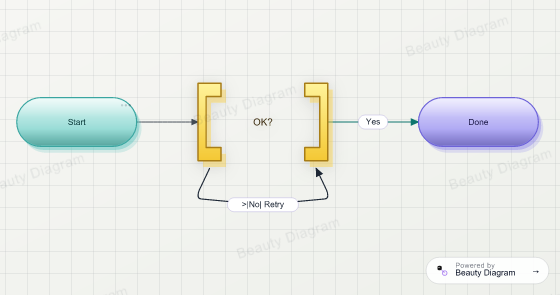
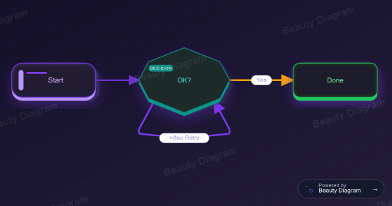
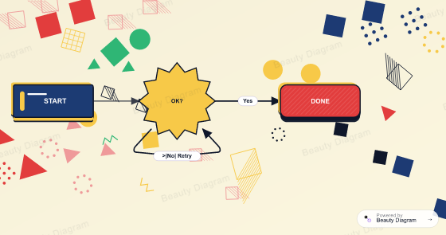
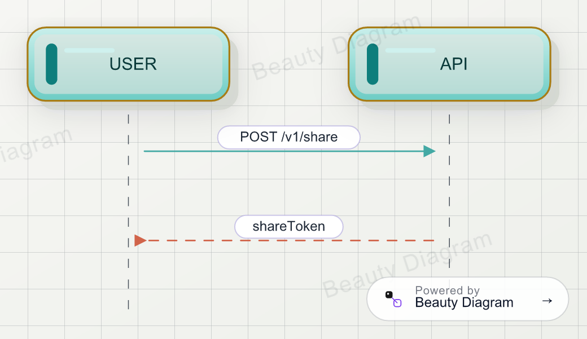
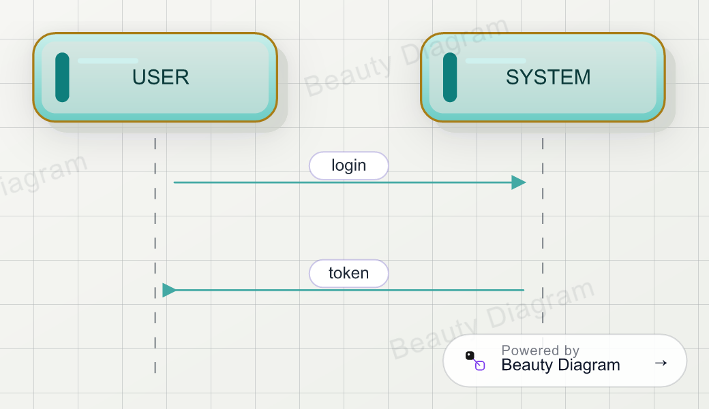

# Beauty Diagram for VS Code

> **Make every `` ```mermaid `` and `` ```plantuml `` block in your Markdown Preview look like a deck slide — 9 themes, dark-mode friendly, zero setup.**

This extension intercepts mermaid and plantuml fenced code blocks in VS Code's built-in Markdown Preview and renders them via the [Beauty Diagram](https://www.beauty-diagram.com) API. Same render quality as Obsidian, Notion embeds, and the standalone editor.

## See it in action

The same `flowchart LR` source, three different themes:

| Modern | Obsidian | Memphis (Premium) |
|---|---|---|
|  |  |  |

## Features

- **9 polished themes**: Classic, Modern, Slate (Free); Atlas, Obsidian, Brutalist, Atelier (Pro); Blueprint, Memphis (Premium)
- **Per-block override** via `%% bd:theme=memphis` (mermaid) / `' bd:theme=memphis` (plantuml) directive
- **`↗ Open in Beauty Diagram editor` CodeLens** above every fence — one click to fullscreen edit, export, share
- **Source injection commands** — write portable `` references into your Markdown so diagrams render in GitHub READMEs, blog static sites, and Notion paste
- **PlantUML supported** with the same theme pipeline (no local Java setup)
- **Self-hostable** via `beautyDiagram.apiBase` setting

## Sequence and PlantUML





## Installation

VS Code Marketplace: search for "Beauty Diagram" in Extensions.

Or from CLI:

```bash
code --install-extension beauty-diagram.beauty-diagram
```

## Usage

### Default render

Open any `.md` file with a `mermaid` or `plantuml` fence. Open the preview (`Cmd+K V` on macOS, `Ctrl+K V` on Windows/Linux). Every block renders via Beauty Diagram automatically.

### Per-block theme override

````md

````

For PlantUML, use `' bd:theme=memphis` instead.

### Source injection (portable diagrams)

When you commit `.md` files to git and have them rendered on GitHub, Notion, blog static sites, etc., run from Command Palette (`Cmd+Shift+P`):

- **Beauty Diagram: Inject embed URLs in current file** — rewrites the active document with `` references next to each fence
- **Beauty Diagram: Inject embed URLs in workspace** — same for every `.md` file
- **Beauty Diagram: Clean orphan embed URLs in workspace** — removes references whose source fence is gone

The marker format is identical to the [`bd` CLI](https://www.npmjs.com/package/@beauty-diagram/cli) and Obsidian plugin — bidirectional idempotency.

## Configuration

Settings → search "beautyDiagram":

| Setting | Default | Notes |
| --- | --- | --- |
| `beautyDiagram.apiKey` | empty | Optional. Anonymous renders are watermarked. Get a key at [beauty-diagram.com/account/api-keys](https://www.beauty-diagram.com/account/api-keys). |
| `beautyDiagram.apiBase` | `https://api.beauty-diagram.com` | Self-host override. |
| `beautyDiagram.defaultTheme` | `classic` | One of 9 themes; per-block directive overrides. |
| `beautyDiagram.replaceMermaid` | `true` | Off lets built-in VS Code preview handle mermaid. |
| `beautyDiagram.handlePlantuml` | `true` | Off leaves plantuml fences as plain text. |

## Privacy

**This extension makes HTTPS requests to `api.beauty-diagram.com` to render diagrams.** Disclosure:

- **Preview**: every mermaid/plantuml block in Markdown Preview triggers a GET to `/v1/beautify.svg` with source base64-encoded in the URL. Server uses to render; does not persist.
- **With API key**: `Beauty Diagram: Inject embed URLs` commands POST source to `/v1/share` so it's saved to your Beauty Diagram account and embeddable.
- **Analytics**: `X-Bd-Client: vscode` header in API calls for aggregate health monitoring. No personal data, no telemetry endpoints.

### Opt-out

- **Disable the extension entirely** — Extensions panel → toggle Beauty Diagram off
- **Disable per format** — turn off `beautyDiagram.replaceMermaid` or `beautyDiagram.handlePlantuml`
- **Self-host** — set `beautyDiagram.apiBase` to your own Beauty Diagram instance

## How it compares

|  | Beauty Diagram | Markdown Preview Mermaid Support | Built-in VS Code |
|---|---|---|---|
| Mermaid support | ✅ | ✅ | ✅ |
| PlantUML support | ✅ | ❌ | ❌ |
| Themes | 9 | 1 | 1 |
| Bundle size | ~10 KB | ~1.5 MB | — |
| Self-host | ✅ | ❌ | — |

## License

MIT. See [LICENSE](LICENSE).
